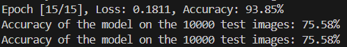
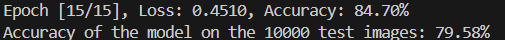
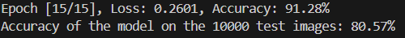

# Task 2： 嗨嗨的摄影图像分类

## 0. Q&A

### 1. 计算机如何存储和处理图像的数据结构？

图像常见的数据结构包括以下几种：

- 压缩格式：
  - 图像通常以JPEG、PNG等格式存储，这些格式对数据进行了压缩以节省存储空间。
  - 在读取这些图像用于处理时，计算机会将这些压缩格式解码为矩阵形式以进行进一步的操作。

- 原始数据形式：
  - 对于灰度图像，计算机会将其存储为二维数组，其中每个元素代表一个像素的灰度值，范围通常是0到255（8位表示），表示从黑到白的渐变。
  - 对于彩色图像（如RGB图像），则存储为三维数组，尺寸是`height x width x 3`。

### 2. 如何设计一个神经网络？一个神经网络通常包括哪些部分？

设计一个神经网络需要考虑网络的结构、层数、激活函数、优化方法等。一个完整的神经网络通常包括以下几部分：

- 输入层：输入层是接收输入数据的部分，比如图像数据、文本数据等。它定义了输入的形状。
- 隐藏层：神经网络中所有非输入和非输出的层，例如：
  - 卷积层：在图像处理领域较为常见，用于提取局部特征。它会在输入数据上滑动卷积核，输出特征图。
  - 激活函数：在每一层的输出上使用非线性函数，如ReLU、Sigmoid、Tanh等，以引入非线性，从而使网络能够学习到更复杂的特征。
  - 池化层：用来减少特征图的尺寸，降低敏感度。常见的有最大池化和平均池化，可以减小计算量和防止过拟合。
  - 全连接层：将所有神经元与前一层神经元完全连接，例如将提取的特征映射到分类空间。
- 输出层：最后一层，通常是一个全连接层，用于输出预测结果。例如，对于CIFAR-10分类任务，输出层有10个神经元，每个神经元对应一个类别。
- 损失函数：计算模型的预测输出与真实输出之间的差距。
- 优化器：用于更新网络参数，减少损失函数的值。

### 3. 什么是欠拟合？什么是过拟合？

- 欠拟合：当模型在训练集上和测试集上的表现都不好，无法捕捉到数据中的重要特征时，就称为欠拟合。
- 过拟合：当模型在训练集上表现很好，但在测试集上表现很差时，就称为过拟合。

## 1. 实现思路

使用CNN模型进行图片分类，`task.py`使用的CNN模型包含：

- **3个卷积层**：

  |      | in_channels | out_channels | kernel_size | padding |
  | ---- | :---------- | ------------ | ----------- | ------- |
  | 1    | 3           | 16           | 3           | 1       |
  | 2    | 16          | 64           | 3           | 1       |
  | 3    | 64          | 128          | 3           | 1       |

  > 每个卷积层后接一个kernel_size为2的池化层

- **2个全连接层**：

  |      | in      | out  |
  | ---- | ------- | ---- |
  | 1    | 128*4*4 | 512  |
  | 2    | 512     | 10   |

  > 第一个全连接层使用ReLU激活函数

```python
self.conv1 = nn.Conv2d(3, 16, kernel_size=3, padding=1) # 卷积层1
self.conv2 = nn.Conv2d(16, 64, kernel_size=3, padding=1) # 卷积层2
self.conv3 = nn.Conv2d(64, 128, kernel_size=3, padding=1) # 卷积层3
self.pool = nn.MaxPool2d(kernel_size=2, stride=2, padding=0) # 池化层
self.fc1 = nn.Linear(128 * 4 * 4, 512) # 全连接层1
self.fc2 = nn.Linear(512, 10) # 全连接层2
```

使用交叉熵损失函数， Adam优化器，batch_size为128，在不同的学习率和训练轮数下的结果如下：

| lr     | epoches | loss   | train_acc | test_acc |
| ------ | ------- | ------ | --------- | -------- |
| 0.0005 | 15      | 0.4269 | 85.41%    | 73.76%   |
| 0.0005 | 30      | 0.0492 | 98.50%    | 72.29%   |
| 0.001  | 15      | 0.1591 | 94.53%    | 72.47%   |
| 0.001  | 30      | 0.0533 | 98.20%    | 72.30%   |
| 0.01   | 30      | 1.0957 | 61.07%    | 52.72%   |

- 可以看出，lr=0.001时，模型的收敛速度最快。
- 训练15轮之后，模型在测试集上的预测效果提升十分有限。

## 2.进阶任务实现

### 1. 可视化训练准确率和loss

解决方法：使用TensorBoard

0. 导入tensorboard库，并在train函数的开始创建一个SummaryWriter.

1. 在trainloader循环里添加以下语句-每100个batch记录一次loss: 

   ```python
   for i, data in enumerate(trainloader, 0):
       if (i + 1) % 100 == 0:
           writer.add_scalar('training loss', loss.item(), epoch * len(trainloader) + i)
   ```

2. 在epoch循环中添加以下语句-记录train/test accuracy: 

   ```python
   writer.add_scalar('train accuracy', accuracy, epoch)
   test_accuracy =  test() # 修改了test()函数以使其返回test_accuracy
   writer.add_scalar('test accuracy', test_accuracy, epoch)
   model.train() # 从eval切回train
   ```

3. 模型开始训练后，在bash中输入`tensorboard --logdir=runs`，打开链接以监视训练情况。

### 2. 提高准确率策略

1. 更改模型结构：

   ```python
   # 卷积层1
   self.conv1 = nn.Conv2d(3, 32, kernel_size=3, padding=1)
   self.bn1 = nn.BatchNorm2d(32)
   # 卷积层2
   self.conv2 = nn.Conv2d(32, 64, kernel_size=3, padding=1)
   self.bn2 = nn.BatchNorm2d(64)
   # 卷积层3
   self.conv3 = nn.Conv2d(64, 128, kernel_size=3, padding=1)
   self.bn3 = nn.BatchNorm2d(128)
   # 卷积层4
   self.conv4 = nn.Conv2d(128, 256, kernel_size=3, padding=1)
   self.bn4 = nn.BatchNorm2d(256)
   
   # 池化层
   self.pool = nn.MaxPool2d(kernel_size=2, stride=2)
   
   # 全连接层
   self.fc1 = nn.Linear(256 * 4 * 4, 512)
   self.dropout1 = nn.Dropout(0.5)
   self.fc2 = nn.Linear(512, 256)
   self.dropout2 = nn.Dropout(0.5)
   self.fc3 = nn.Linear(256, 10)
   ```

   - 添加更多的卷积层和全连接层，以提高模型对图像的特征提取能力。
   - 使用批归一化`BatchNorm`来加速训练并提升模型稳定性。
   - 在全连接层前使用`Dropout`来防止过拟合。

2. 将图像适当缩放以使卷积神经网络提取更丰富的特征

   - 在transform中添加`transforms.Resize((64, 64))`以使图像放大至64*64。

   以下为不同size的测试结果(batch_size=128, lr=0.001)：

   - 不改变size: 

   

   - size = 128*128: 

   

   - size = 64*64

   

   可以看到将图像放大一倍之后的效果较好。