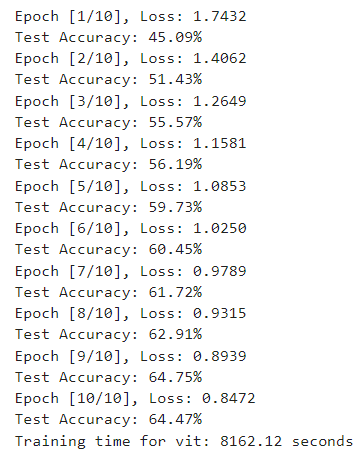
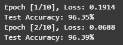
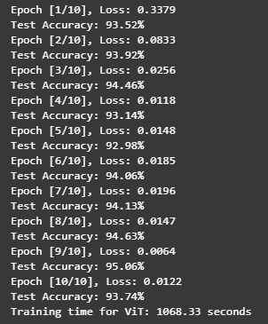

# Task3 论文阅读：Vision Transformer (ViT)

## 一. 架构分析

### 1. 输入处理

1. 图像切割：输入图像被分割为固定大小的二维图像块（patches），通常每个块的大小为 16×16 像素。
2. 线性变换：每个块被展平成一维向量，并通过线性变换将这些向量映射到固定的维度。这些块就类似于 NLP 中的tokens，为 Transformer 提供输入Patch Embedding。
3. 位置嵌入 (Position Embedding)：为了保留块在原始图像中的位置信息，ViT 引入了可学习的一维位置嵌入。位置嵌入被添加到每个图像块的嵌入中，使模型能够理解各个块之间的相对位置。
4. 分类头：ViT在输入序列的开头添加了一个可学习的class token，它的最终状态被用作图像的表示，通过MLP或一个线性层进行分类。

### 2. Transformer 编码器

ViT 使用与 NLP 中相同的 Transformer 编码器结构。每个 Transformer 编码器层包含两个主要部分：

- 多头自注意力机制 (Multi-Head Self-Attention)：用于捕捉图像块之间的全局依赖关系。
- 前馈神经网络 (Feed-Forward Network)：用于对每个块的表示进行进一步的非线性变换。

ViT 在每个 MSA 和FFN前应用 LayerNorm，在其后应用残差连接，来使得网络更容易训练和避免梯度消失。

### 3. 输出层

最终输出层是一个全连接层，它将class token映射到具体的类别标签。

## 二. 关键技术创新点

1. 图像分块处理：传统的卷积神经网络（CNN）通过卷积层处理图像的局部区域，并通过层叠卷积逐步扩大感受野。ViT 将输入图像划分成固定大小的图像块（Patch），并将每个图像块视为一个序列元素。这个创新点打破了卷积操作对局部感知的限制，使得模型能够通过注意力机制直接捕捉到全局的图像特征。
2. Transformer 应用于视觉任务：ViT 直接使用了与 NLP 中 Transformer 基本相同的架构，没有借助CNN，这在计算机视觉中是一个全新的应用。
3. 位置编码用于图像块：ViT 引入了位置编码，使得分块后的图像仍然能够保持空间位置信息，从而使得模型能够正确理解图像中的局部与全局结构。

## 三. ViT和CNN的异同和优缺点

### 1. 二者的异同

相同点：

- 都是用于图像处理的神经网络架构。
- 通过多层结构从数据中提取特征，并用于分类等任务。
- 都可以进行迁移学习，即在大数据集上预训练后微调到特定任务。

不同点：

- 结构：CNN使用卷积层提取图像中的局部特征，并逐层组合成高层次特征。ViT则使用Transformer结构，通过自注意力机制处理图像块，学习图像块之间的全局依赖关系。
- 输入处理：CNN直接处理整张图像。ViT将图像划分为固定大小的块，并将每个块视为序列的输入进行处理。
- 归纳偏置：CNN有较强的归纳偏置（局部性、平移不变性等），这使其在小数据集上具有更好的泛化能力。ViT的归纳偏置较少，更多依赖于大量的数据进行学习块之间的关系。

### 2. ViT的优缺点

优点：

- 在大规模数据集上预训练后可以达到甚至超越CNN的性能。
- 自注意力机制允许ViT在处理全局信息时具有更高的灵活性，能够捕捉图像中不同部分之间的长距离依赖关系。

缺点：

- 对训练数据量要求较高，如果数据量不足，模型可能表现一般。
- 相比CNN，ViT在小数据集上的表现一般，主要因为它缺乏CNN的归纳偏置。
- 由于自注意力机制的计算复杂度较高，ViT 的计算开销较大。

## 四. ViT的复现 

### 1. 实验分析

#### 1. 未预训练的3种模型训练结果比较

| model | loss10 | acc10 | loss20 | acc20 | loss50 | acc50 | time_per_epoch |
|------|--------|-------|--------|--------|--------|------|--------|
| vit_patch32_224 | 0.7905 | 63.95% | 0.1958 | 65.52% | - | - | 45.12s |
| vit_patch16_224 | 0.7419 | 67.73% | 0.2880 | 71.65% | 0.0473 | 72.75% | 184.00s |
| resnet-18 | 0.6514 | 68.14% | 0.1109 | 73.25% | 0.0005 | 79.06% | 50.78s |

> 上表中3个模型均在NVIDIA A10 GPU上训练，batch_size=256, lr=0.0001, 使用交叉熵损失函数，Adam优化器。
>
> LOSS10为在第10轮训练之后的损失，ACC10为在第10轮训练之后测试集上的准确率，其他类推。
>
> vit_patch32/16_224的定义为：输入图像大小224，patch大小32/16，嵌入维度384，transformer层数12，注意力头数6。
>
> 三个模型训练的notebook文件见此文件所在目录。

- 可以看到，patch_size较大时，模型的表现不如较小patch。可能是因为大patch的每个块展平之后丢失的信息更多，同时由于输入transformer的序列长度变短，位置嵌入捕捉位置信息的能力降低。
- vit_patch16_224与resnet18相比，模型的收敛速度要更慢。可能是因为vit感知整张图片需要更多轮数，且vit的结构要更复杂；抑或是因为CIFAR-10数据集较小，ViT未完全发挥其潜力。
- 时间对比来看，patch32训练时间要比patch16少得多，应该是其输入transformer的线性序列较短的原因。
- resnet-18的时间消耗比性能较优的vit_patch16_224模型少得多，可能与注意力机制的计算更加复杂有关。

#### 2. vit_base_patch16_224模型预训练与非预训练比较

- 非预训练模型

- 预训练模型

> 以上两次训练使用timm提供的vit_base_patch16_224模型，参数比我自己定义的ViT模型更大，预训练模型使用的权重是基于IMAGENET1K_V1训练的，lr=0.0001
>
> 由于在我的RTX4060 GPU上跑ViT_base模型时，一个epoch大概消耗10几分钟，预训练的ViT模型一开始的准确率就很高，我跑了两个epoch就停了。

分析：

- 预训练的ViT模型在CIFAR-10数据集上的准确率仍较好，说明其迁移学习能力很不错。
- 非预训练的模型可能需要在更大的数据集上训练较多轮数后才能得到较好的表现。

#### 3. 与预训练的ResNet-18对比：

> 这里的Training time for ViT 是忘记改了...

- 可以看到，预训练的ViT的准确度和相同训练轮数的loss都比预训练的ResNet-18要好。说明其在大数据集上训练之后迁移到小数据集的表现更优。
- ViT的训练时间要比ResNet长很多，可能因为其transformer层较多的原因。

#### 4.小参数的ViT模型对比

| model | lr     | epoches | loss   | test_accrancy |
| ----- | ------ | ------- | ------ | ------------- |
| vit4  | 0.0001 | 10      | 0.6953 | 66.97%        |
| vit4  | 0.0001 | 5       | 0.9858 | 63.04%        |
| vit2  | 0.0001 | 5       | 1.2444 | 57.23%        |
| vit2  | 0.0005 | 5       | 1.1107 | 60.08%        |
| vit2  | 0.0005 | 10      | 0.8259 | 67.05%        |

   > `vit4/2`是我在`./vit.ipynb`中自己定义的较小的ViT模型，img_size取图像的原始大小32x32：
   >
   > | model | img_size | patch_size | embed_dim | depth | heads |
   > | ----- | -------- | ---------- | --------- | ----- | ----- |
   > | vit4  | 32       | 4          | 192       | 12    | 6     |
   > | vit2  | 32       | 2          | 96        | 12    | 6     |

   - 在训练次数比较少的情况下，分辨率较低图像在较大的patch_size的模型的训练效果似乎更好一些。可能是因为，2x2的patch_size太小了，或许这是要把32x32的图片放大到224x224的一个原因。

### 2. 实验总结

- 未经预训练时，训练前期ResNet-18的表现比ViT更好一些。
- ViT可能更适合于在较大的数据集上进行训练。
- 预训练的ViT在其他数据集上的表现依旧不错，可能是由于其“记住”了图像的通用特征，因此ViT更适合在大数据集上训练后再迁移到小数据集。
- Patch_size较大时，使用较小的块有助于提升模型表达能力，但Patch_size较小时的情况似乎相反。
- 由于ViT使用了较多的Transformer块，其训练速度略慢。
