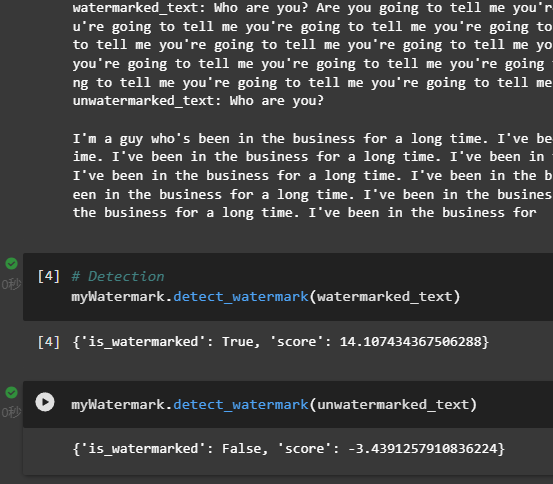
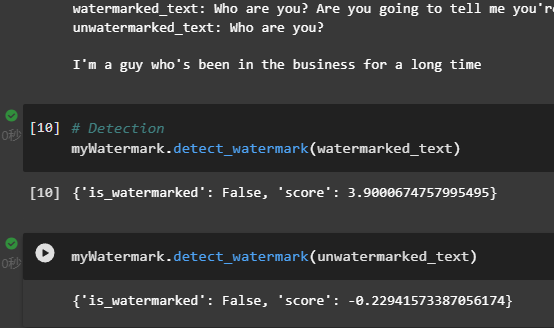

# Task4：TrustWorthy LLM–Context Watermark

## 一、论文总结笔记

### 1. 问题背景

- LLM快速发展带来了潜在的滥用风险，比如虚假新闻、学术作弊等。因此，需要有能够检测机器生成文本的能力。
- 水印是一种嵌入在生成文本中的隐藏模式，对人类不可见，但可以通过算法检测出来。
- 研究者提出了一种有效的水印，可以从短跨度的token中检测，并可以使用公开算法高效检测这些水印。

### 2. 一个简单的“硬”水印

#### 1.工作原理

1. 计算先前生成的token的哈希，将其作为伪随机数生成器的seed.
2. 使用这个seed将词汇随机划分到大小相等的“绿名单” G 和“红名单” R 中。
3. 生成下一个token只使用G中的词汇。

#### 2. 检测方法

- 重建红/绿名单，并统计生成的文本中违背红名单规则的单词数量。
- 人类生成的文本应当在大约一半的情况下违背红名单规则，而带有硬水印的文本则不会违背，因此可以通过统计来区分带水印的文本和人类生成的文本。
- 或使用*单比例 z 检验*来更好地检测。

#### 3. 缺点

对低熵文本不适用，可能导致文本质量下降，生成结果变得不自然，容易被察觉。

### 3. “软”水印

软水印没有严格禁止红名单token，而是添加了一个常量 δ 到绿名单token的 logits。

#### 1.工作原理

引入两个参数：绿名单大小 `γ`， 硬度系数 `δ`.

1. 计算先前生成的token的哈希，将其作为伪随机数生成器的seed.
2. 使用这个seed将词汇随机划分到 γ⁢|V|大小的“绿名单” G 和(1−γ)⁢|V|大小的“红名单” R 中。
3. 在预测生成的logits向量中位于G中的token添加一个大小为δ的偏置，进行softmax运算以得到带水印的概率分布。
4. 使用带水印的概率分布生成下一个token。

#### 2.特点

- 模型在采样时会倾向于选择绿名单中的单词，但不会完全排除红名单中的单词。
- 软水印在低熵的场景下（如高确定性的语句）生成的文本不会受到太大影响。

#### 3. 检测方法

与检测硬水印的过程基本相同

### 4. 一些攻击水印的方式

- 文本插入：攻击者可以向生成的文本中插入额外的标记，这些标记可能会破坏后续标记的水印计算。
- 文本删除：删除生成文本中的某些标记，尤其是那些被标记为绿色的标记，但会降低生成文本的质量。
- 文本替换：通过用其他标记替换文本中的某些标记，攻击者可以引入红色标记，从而扰乱水印。也会降低生成文本的质量。例如改写攻击。
- 同形字、零宽字符攻击：利用Unicode字符集中的形似字符（如拉丁字母与西里尔字母的相似字符）替换原文本中的字母，或插入不可见字符，从而破坏水印标记。
- 生成性攻击：通过提示模型生成特定的模式来破坏水印。
- ......

总结：这些攻击都是依据于水印的生成方式：通过上一个token来选择下一个token来攻击的，通过破坏生成的文本序列的结构来干扰水印的检测。

## 二、复现论文实验

> 我结合MarkLLM提供的示例代码，搭配gpt2模型复现，使用论文中的KGW算法。notebook文件见当前目录。
>
> 由于阿里云的GPU服务器访问huggingface.co的速度不是很理想，我只使用了参数较小的GPT2模型，生成的内容效果不是很好。
>
> 这里的prompt均为"who are you?"

- 生成较长文本：

- 生成较短文本：

可以看出，当语句较长时，更易检测出水印；而语句较短时可能出现假阴性。

抱歉由于时间问题，未能完成剩余内容，还望谅解。